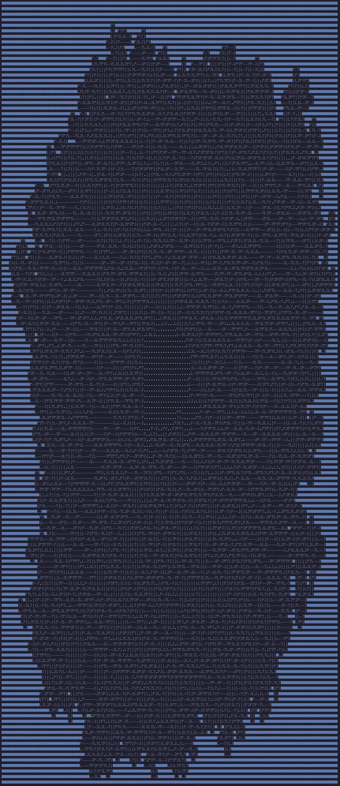

# Advent Of Code - 2023

This is the first year that I'm actually tackling the Avent Of Code challenge. 
I've been wanting to do it for a few years now, but never got around to it. This year I'm going to try and do it in <span style="color: #189ad3; font-weight:bold">C#</span> since it's been a while since I've done any .net development.

---


## Notes for each day

<details>
<summary>Day 1 - <code style="color: #189ad3; font-weight:bold">Trebuchet</code></summary>

---

Pretty straight forward. 
I did have to look up how to read a file line by line in C#.

---

</details>


<details>
<summary>Day 2 - <code style="color: #189ad3; font-weight:bold">Cube Conundrum</code></summary>

---

- Part 1 and 2 were easy enough, I did make mistake in part 2 when I was only looking at valid games, but should have been looking at all games.
- Created a Utility class to help with reading input files, since it's boring doing the same thing over and over again.

---

</details>


<details>
<summary>Day 3 - <code style="color: #189ad3; font-weight:bold">Gear Ratios</code></summary>

---

- Was also able to get both parts done in one pass, which was nice.
- Enjoyed this one,especially needing to consider the adjacent squares based on the number of digits in the number.

---

</details>

<details>
<summary>Day 4 - <code style="color: #189ad3; font-weight:bold">Scratchcards</code></summary>

---

Part 1 was simple, but part 2 was a bit more challenging. I ended up using a dictionary to store the number of copies of a card. 
I'm sure there's a better way to do it, but this worked for me. 

---

</details>

<details>
<summary>Day 5 - <code style="color: #189ad3; font-weight:bold">Fertilizer</code></summary>

---

Part 1 was not too bad, but part 2 completely messed me up all because I didn't RTFM :anger: and missed this little line in the instructions:

```text
Any source numbers that aren't mapped correspond to the same destination number. So, seed number 10 corresponds to soil number 10.
```

Note to self: 
I need to do some work to learn how to more efficiently work with large data sets in C#. Waiting 10 minutes for the program to run is not fun.
Note that I did print update messages to the console every 10,000,000 records processed to get some visual feedback.
- Did get some performance improvement by using [Parallel.ForEach](https://learn.microsoft.com/en-us/dotnet/standard/parallel-programming/how-to-write-a-simple-parallel-foreach-loop)
- Also added [BenchmarkDotNet](https://benchmarkdotnet.org/) to get some metrics on how long it takes to run the process.

| Part | Seed Count| Run Duration (M:S:MS) | 
| --- | --- | --- |
| Part 1 | 20 | 0:00:07 |
| Part 1 | 20 | 0:00:10 |
| Part 2 | 1,707,939,106  | 7:17:201 |
| Part 2 | 1,707,939,106  | 6:59:520 |

- Estimated Records Processed Per Minute: 243,991,300  
- Estimated Records Processed Per Second: 4,066,521
- Estimated Records Processed Per Millisecond: 4,066

_I also learned how to make collapsable sections in markdown, and add a splash of color using span tags which is pretty cool._

---

</details>

<details>
<summary>Day 6 - <code style="color: #189ad3; font-weight:bold">Wait For It</code></summary>

---

On a non project related note, I learned how to use emojis in markdown :sunglasses:

Found this to be a much easier day than yesterday.
Basic maths to the rescue: 

```math
distance = speed * time
```

---

</details>

<details>
<summary>Day 7 - <code style="color: #189ad3; font-weight:bold">Camel Cards </code></summary>

---

I enjoy card related puzzles, probably because it's something that's not abstract and I can relate to it.

In this case, the approach I took was to use [IComparable](https://learn.microsoft.com/en-us/troubleshoot/developer/visualstudio/csharp/language-compilers/use-icomparable-icomparer) interface to sort the hands based on their strength, and comparing their cards to determine the winner when strength is equal.
- This drastically reduced the "complexity" of the solution.
- Combined with the fact that I already stored the "value" of each label / suit meant that part 2 was a breeze.

---

</details>


<details>
<summary>Day 8 - <code style="color: #189ad3; font-weight:bold">Haunted Wasteland</code></summary>

---

There are times in life when you realize that you still tend to over-complicate things!
As per usual, part 1 was simple as, but part 2, well.... Let's just say that I don't like feeling like and idiot, but this time I truly deserved to!

First attempt for part 2 was to *Brute Force* it.
Then I ran it... 
```terminal
10 minutes later - hhmmmm, that can't be right...
    - Checks the code, nope, logic looks good.
20 minutes later - WTF, it's still running...
1 hour later - I'm an idiot!
    - Too tired to care, so I leave it running overight.
Next morning - Bugger, power saving feature kicked in after 15 minutes, so it didn't run.
5 hours later, still running.

OK! - FINE! - I'll think of another way.
```

Now, my dad always taught me that you shouldn't force something open, and in this case his advice would have helped.
In an attempt to find another solution, I modified the code to run through each starting 'xxA' node seperately and see how many each step takes to get to a solution.
That's when it hit, me. Using those numbers, I could find the Least Common Denominator to get to the answer...
So my little grug brain found an implementation online, used it and urika! Got the answer.

---

</details>


<details>
<summary>Day 9 - <code style="color: #189ad3; font-weight:bold">Mirage Maintenance </code></summary>

---

Not much to say for this one. Was able to use lists to calculate next and previous values to solve the problem.
Breaking the logic up into smaller methods was key to making this simple.

---

</details>


<details>
<summary>Day 10 - <code style="color: #189ad3; font-weight:bold">Pipe Maze </code></summary>

---

Part 1 - Simple, Easy, nuf said.
Part 2 - I'm still stumped at this point, will come back to it later, but I do have a pretty picture to show for it :sunglasses:

Most interesting for me was implementing a basic "flood fill" algorithm to find "enclosed" areas.




---

</details>

<details>
<summary>Day 11 - <code style="color: #189ad3; font-weight:bold">Cosmic Expansion </code></summary>

---

Really enjoyed this one.
The primary take away for me is that I'm finally starting to think of solutions that are more calculation focussed, rather than brute force.
IE, was able to calculate the shortests paths by simple calculation and "expanding" the galaxy by calculatinbg the impact of the expansion on each galaxy rather than "building" it.

Flow: 
- Create a list of Points for each galaxy in the input.
  - Calculate what their coordinates would be based on the expansion factor.
- Determine all possible pairs of galaxies
- Add up the distance between each pair

```csharp
private static List<Point> Get_Points_In_Galaxy(List<List<char>> map, int empty_space_multiple)
    {

        (List<int> empty_rows, List<int> empty_columns) = get_indexes_to_expand(map);

        List<Point> objects = new List<Point>();

        for (int y = 0; y < map.Count; y++)
        {
            for (int x = 0; x < map[y].Count; x++)
            {
                if (map[y][x] != '.')
                {
                    int new_x = x;
                    int new_y = y;

                    if (empty_space_multiple != 1)
                    {
                        var col_count = empty_columns.Where(c => c < x).Count();
                        var row_count = empty_rows.Where(r => r < y).Count();

                        new_x = x + ((col_count * empty_space_multiple) - col_count);
                        new_y = y + ((row_count * empty_space_multiple) - row_count);
                    }

                    objects.Add(new Point(new_x, new_y, GalaxyObjectType.Galaxy));
                }

            }
        }

        return objects;
    }
```

Note: I wasted a lot of time here, because the instructions solutions for expanding the universe by "10" and "100" were incorrect. (Should have been by "5" and "50" respectively)

---

</details>

<details>
<summary>Day 12 - <code style="color: #189ad3; font-weight:bold">Hot Springs </code></summary>

---

Part 1 - Simple, Easy, nuf said.

Note: I did however learn more about regular expressions in this one.
```text

^\.*#{1}\.+#{1}\.+#{3}\.*$

```

Part 2 - Still working on this one, brute force will not work, so I need to find a better way to calculate the answer.

---

</details>


<details>
<summary>Day 13 - <code style="color: #189ad3; font-weight:bold">Point of Incidence </code></summary>

---

Part 1 - Completed
Finally did this, but the instructions are very vague, and had to read multiple times to understand what was required, or rather, what was a "valid" mirror.

Part 2 - Not completed
Struggling with this, I believe I've already found the "smudges", but still working on how exactly I will calculate the answer.

---

</details>

<details>
<summary>Day 14 - <code style="color: #189ad3; font-weight:bold">Parabolic Reflector Dish </code></summary>

---

Part 1 - Completed
I really like "physics" related puzzles, and this one was awesome!
Building up a bit of a library to do 2d array manipulations.

Part 2 - Not completed
... Not sure yet how I am going to tackle this one. I currently have no idea, but I know that there is a mathematical solution to simulate this rathern than brute force it.
Will do some homework to find how people generally "simulate" these types of problems.

---

</details>

<details>
<summary>Day 15 - <code style="color: #189ad3; font-weight:bold">Lens Library </code></summary>

---

Not much to say about this one. Basic logic required, and they clearly tried to make it complex by mixing up index 0 vs 1 values.

---

</details>

<details>
<summary>Day 16 - <code style="color: #189ad3; font-weight:bold">The Floor Will Be Lava </code></summary>

---
Part 1 - Completed
Took me longer than expected this one. I did get the answers correct every time, but the logic was an interesting one.
Naming variables correctly is key to making the logic easier to follow, especially when you're dealing with a 2D array and might confuse x|y vs row|column.

Part 2 - Completed
This one was a bit easier, because I fortunately had the logic for part 1 already in place which included passing a "starting" tile and direction, so it was just a matter iterating 
through the tiles along the edge and calling the same method.

---

</details>

<details>
<summary>Day 17 - <code style="color: #189ad3; font-weight:bold">TODO </code></summary>

---

TODO

---

</details>

<details>
<summary>Day 18 - <code style="color: #189ad3; font-weight:bold">TODO </code></summary>

---

TODO

---

</details>

<details>
<summary>Day 19 - <code style="color: #189ad3; font-weight:bold">TODO </code></summary>

---

TODO

---

</details>

<details>
<summary>Day 20 - <code style="color: #189ad3; font-weight:bold">TODO </code></summary>

---

TODO

---

</details>

<details>
<summary>Day 21 - <code style="color: #189ad3; font-weight:bold">TODO </code></summary>

---

TODO

---

</details>

<details>
<summary>Day 22 - <code style="color: #189ad3; font-weight:bold">TODO </code></summary>

---

TODO

---

</details>

<details>
<summary>Day 23 - <code style="color: #189ad3; font-weight:bold">TODO </code></summary>

---

TODO

---

</details>

<details>
<summary>Day 24 - <code style="color: #189ad3; font-weight:bold">TODO </code></summary>

---

TODO

---

</details>

<details>
<summary>Day 25 - <code style="color: #189ad3; font-weight:bold">TODO </code></summary>

---

TODO

---

</details>